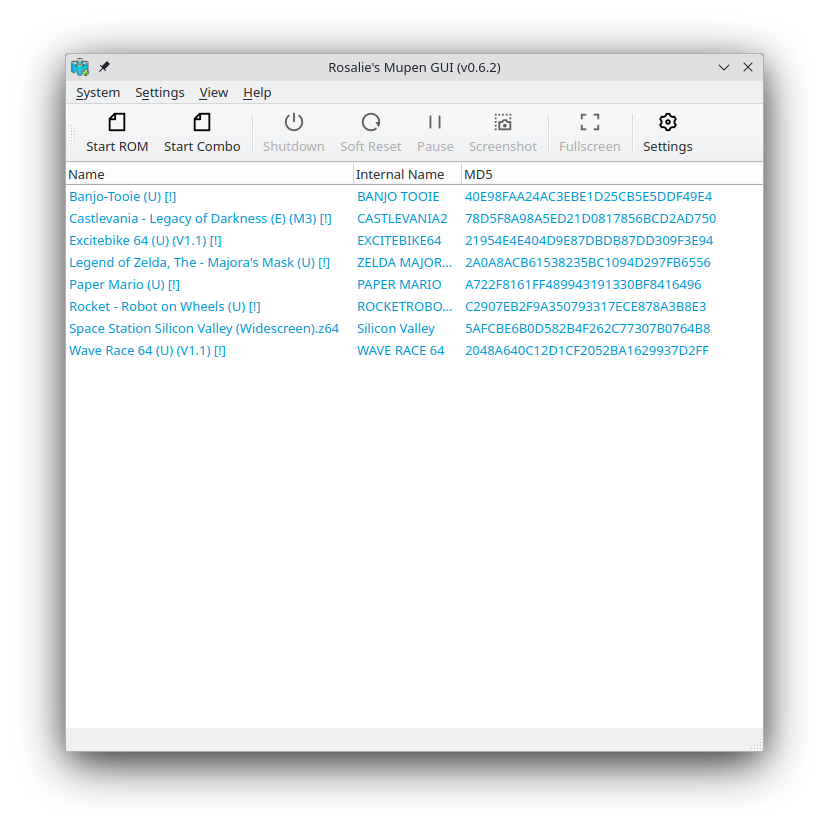
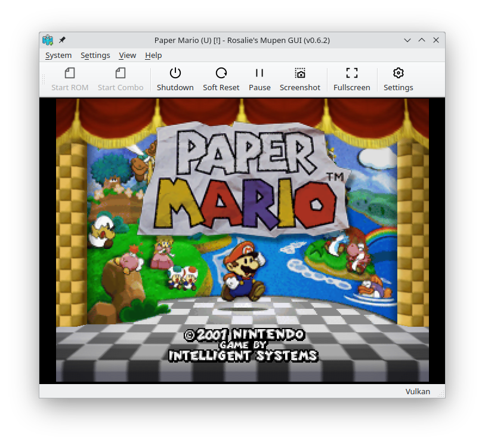
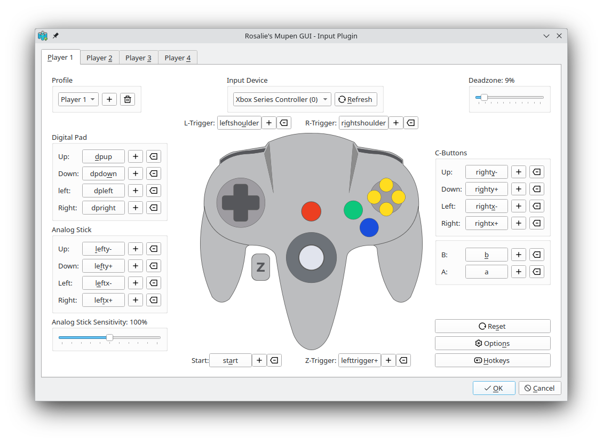

# Cheps' Mupen Fork 

Cheps' Mupen Fork is a free and open-source (Windows ONLY!) mupen64plus front-end/Rosalie's Mupen GUI FORK written in C++.

# WARNING!
This FORK is not intended for public use. I won't discourage you from compiling it if you want to but please don't.

It offers a simple-to-use user interface.

## Download

#### Windows
You can download Cheps' Mupen Fork on  if I release it.

## License

Rosalie's Mupen GUI/Cheps' Mupen Fork is licensed under the [GNU General Public License v3.0](https://www.gnu.org/licenses/gpl-3.0.en.html).

## Showcase





## Building

The building process is the same from the original RMG. However I will only list the windows BUILDING PROCESS here since it is the OS I use.

#### Windows
* Download & Install [MSYS2](https://www.msys2.org/)
```bash
pacman -S --needed make mingw-w64-x86_64-cmake mingw-w64-x86_64-gcc mingw-w64-x86_64-hidapi mingw-w64-x86_64-freetype mingw-w64-x86_64-libpng mingw-w64-x86_64-qt6 mingw-w64-x86_64-SDL2 mingw-w64-x86_64-speexdsp mingw-w64-x86_64-libsamplerate mingw-w64-x86_64-nasm mingw-w64-x86_64-minizip mingw-w64-x86_64-vulkan-headers git
./Source/Script/Build.sh Release
```

When it's done building, executables can be found in `Bin/Release`
